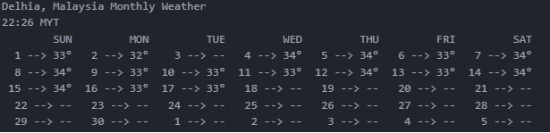

# CloudSEK web crawling task

It is a web crawler which scrappes the weather from https://weather.com. Based on the choice of places and type of forecast it generates weather report ie., temerature, humidity, wind speed, etc.

There are six types of forecast available in this website i.e., Today, Hourly, 5-day, 10-day, Weekend, Monthly. I have developed application which takes input as place and type of forecast (*today/hourly/monthly*) and return weather reports of current time.


## Getting Started

First download the whole repository into your PC. Then navigate to the project using ```cd``` command.  
Then all you need is to run the python program **App.py <place_name> <forecast_type (optional)>**.  
**forecast_type available = today/hourly/monthy**  
You must pass atleast one argument as place name.

### Prerequisites

First you should have [Python 3](https://docs.python.org/3.0/) installed in your PC. If it's not installed one can easily install it through following links:

* [Installing Python 3 on Mac OS X](https://docs.python-guide.org/starting/install3/osx/)
* [Installing Python 3 on Linux](https://docs.python-guide.org/starting/install3/linux/)
* [Installing Python 3 on Windows](https://docs.python-guide.org/starting/install3/win/)


### Installing

After installing python 3 we need to again install all the necessary dependencies in order to run the script.

It's always recommended to use [Virtual Environment(virtualenv)](https://packaging.python.org/guides/installing-using-pip-and-virtualenv/) before installing dependencies as virtualenv allows you to manage separate package installations for different projects. It essentially allows you to create a “virtual” isolated Python installation and install packages into that virtual installation. One can easily install, create and activate virtualenv by following the link mentioned below :

* [Virtual Environment(virtualenv)](https://packaging.python.org/guides/installing-using-pip-and-virtualenv/)

After that you can install 'requirements.txt' as it contains all the necessary dependencies you need to run the script. To install all the dependencies at once you just need to install pip and run the following command:

```
pip3 install requirements.txt
```

It can also be installed manually one by one by running the following commands:

```
pip install requests==2.18.4
```

```

pip install selenium==3.141.0
```   
You need to download chrome driver for this application. Check your  chrome browser version in your browser setting and based on the version you can download from the below link.  

[Chrome version 77](https://chromedriver.storage.googleapis.com/index.html?path=77.0.3865.40/)  
[Chrome version 76](https://chromedriver.storage.googleapis.com/index.html?path=76.0.3809.126/)  
[Chrome version 75](https://chromedriver.storage.googleapis.com/index.html?path=75.0.3770.140/)  

Once you download chrome driver then keep the **chromedriver.exe** file in the same directory where **App.py** is present.  


## Sample Input  
To run the application type  

```
cd web-crawling-task
```  
```
python App.py delhi hourly
        or
python App.py delhi
```  
**By default it take forecast type as today**  
<br />
Based on your network connectivity it takes some time to load that file. If the network connection is very low it will show "Slow connection!".  

The above code will generate all possible available places based on your place name and you need to to choose any one place by entering the number corresponding to it.


## Sample Output  

Given below the sample output  
- Today forecast type  
  

- Hourly forecast type
<br />

  

- Monthly forecast type
<br />



## Built With

* [Requests](http://docs.python-requests.org/en/master/) - HTTP for Humans™
* [BeautifulSoup](https://www.crummy.com/software/BeautifulSoup/bs4/doc/) - A library for pulling data out of HTML and XML files.
* [Selenium](https://www.seleniumhq.org/) - It is for automating web applications for testing purposes, but is certainly not limited to just that.

## Authors

* **[Nishant prajapati](https://github.com/nishantprajapati123)**

## License

This project is licensed under the MIT License - see the [LICENSE.md](LICENSE.md) file for details.
